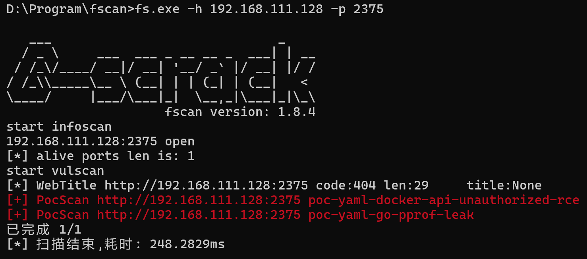
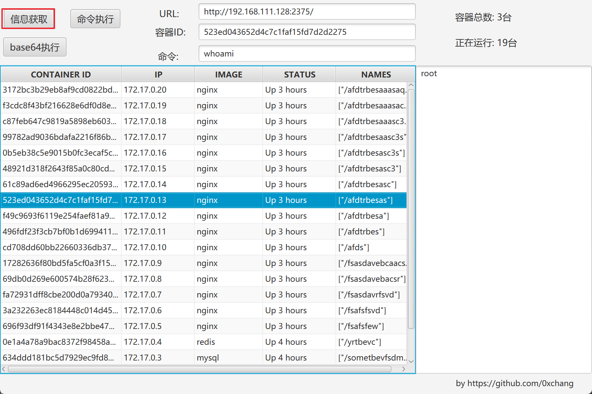
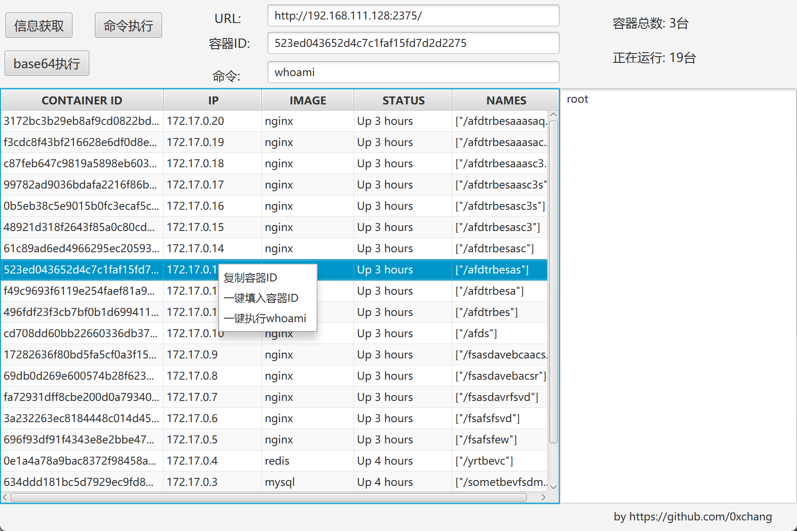

# DockerApiRCE
DockerApiRCE

当内网遇到docker api未授权访问时，需要截图统计数量和执行命令证明获取相关权限，要求主机必须有docker环境才能操作，而且不方便，写这个工具便于快速统计和一键执行命令，方便截图使用，而且无需主机装有docker。

打开工具填入url即可

一键执行命令

### 更新记录

#### v.04

* 新增查询所有特权模式容器
* 新增添加特权模式容器
* 修复使用代理时https证书问题

#### v0.3

* 详细区分镜像总数、容器总数、容器运行数。

#### v0.2

* 新增代理功能
